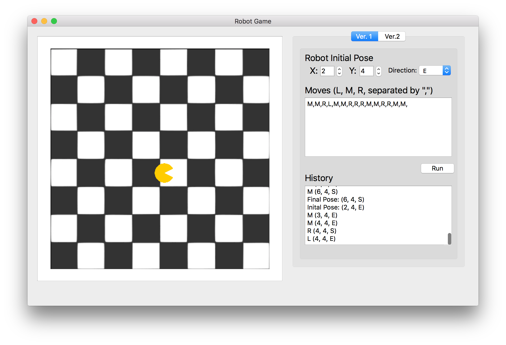
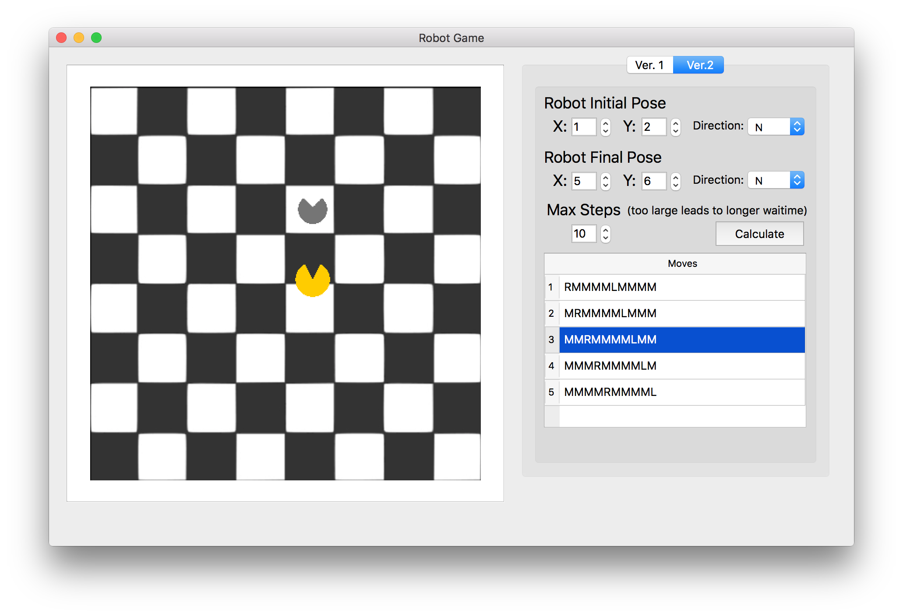

# Robot Game
This is a robot game visualized with animation built with Qt creator in C++. 

## **Game Rule**:
The board is set to be a 8x8 squre board, with its positive X-axis defined as East, and positive Y-axis defined as North(pointing upward). The position of the left down cell is (1, 1), and the right up celll is (8, 8). The robot can navigate thorugh the board with some valid actions.

Valid Actions:
- M: Move forward
- L: Turn left
- R: Turn right

Constraints:

At a boundary, the robot can only turn left/right.

### Version 1:
Given a starting position [x, y] (0 < x, y < 9), direction faced (W, S, N, E)
on a 8x8 square board, and a sequence of actions (M, L, R) for a robot, calculate
its final position and direction on the board.

Example
```
Location: [2,3]
Direction faced: N
Actions: M,M,M,L,M,R,R,R
Output:
Location : [1,6]
Direction faced:S
```
### Version 2:
Given a starting position [x,y] (0<x,y<9), initial direction faced (W, S, N, E) on 8 x 8 square board and the target position, direction and maximum actions allowed, print all possible actions robot can make to get to that position.

Example
```
Original position: [2,3]
Original Direction faced: N
Target position: [3,4]
Target Direction: S
Maximum actions allowed: 4
Output:
Actions - 1 : M,R,M,R
No more possible actions!
```

## Installation
### Player
The game is deployed into a dmg file for mac users. (Apologies to window users)
Open the dmg file, click on the roboyGame, and here you go.

### Developer
For those who want to continue the project, Qt Creator is needed. The project is developed unter QT 5.3, and any version higher than this should be no problem.

[Deployment Tips]
There's a useful deployment tool called **macdeployqt**, which adds all the necessary Qt libraries the project references. When the project is ready to deployed, open the terminal, navigate to the project folder, and type the commands:
```
macdeployqt robotGame.app -dmg
```
If you encounter "command not found: macdeployqt", please add the full path to macdeployqt to shell path, or specify the full path to macdeployqt to it. It's usually located in /Users/usrName/Qt/QT_VERSION/clang_64/bin.


## Usage
Version1:



- Choose the initial pose of the robot.
- Type some actions that you want the robot to move. (M,L,R seperated by ",")
- Click Run, and the robot will start moving around the board.


Version2:



- Choose the initial, final pose of the robot, and the maxStep.
- Click calculate, and there should be some valid sequences of moves provided. (If there's any)
- Double click any move in the table, the robot will move according.
